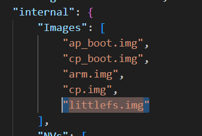

# SLM130NA-SoftSIM-littleFS
SoftSIM需要的文件系统生成代码, 与 [SLM130NA-SoftSIM-C0005](https://github.com/seer300/SLM130NA-SoftSIM-C0005) 配合使用  

将此项目编译生成的`littlefs.img`放到`V1200FB10002R00C0005/allbins`下  

请注意提前确认：`config.json`文件已经添加  

# 如何编译
在Windows cmd下, 运行`gen_img.bat`脚本(提前配置好Python环境)  

## Release
本项目提供目前可用的`littlefs.img`。需要请去Release下载  